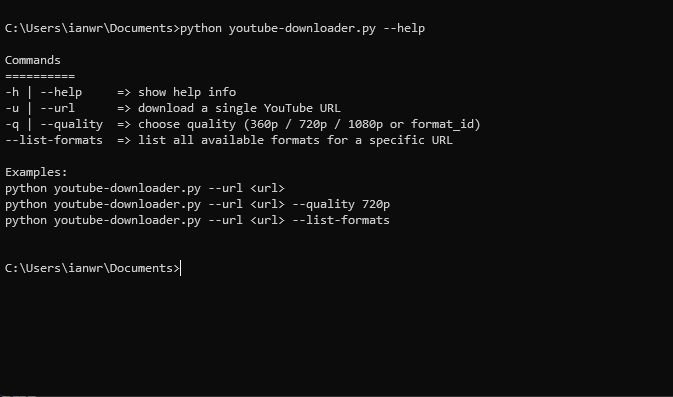
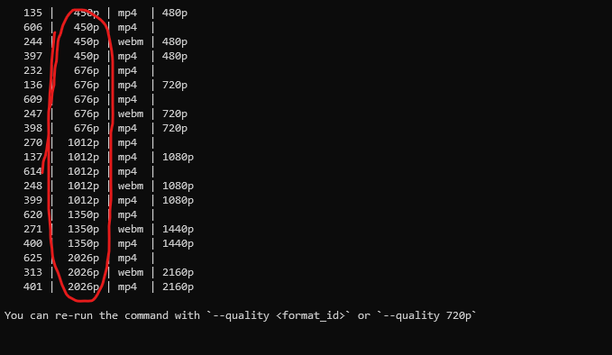

# 🎥 YouTube Downloader CLI Tool

A powerful and **easy-to-use** command-line YouTube downloader using [yt-dlp](https://github.com/yt-dlp/yt-dlp).  
Download videos in your preferred quality, or inspect all available formats before downloading.

---

## 🛠️ Features

- Download videos by **URL**
- Choose **video quality** (e.g. `720p`, `1080p`, or exact format ID)
- **List all available formats** before downloading
- Auto-download from a list of saved links (`youtube_links_to_download.py`)
- Merges audio and video into `.mp4` (uses `ffmpeg` if available)

---

## 🖥️ Usage

### 🔍 Help
Run this to see all available commands:
```bash
python youtube-downloader.py --help
```

📸 Example output:  


---

### 🎯 Download a single video
```bash
python youtube-downloader.py --url https://www.youtube.com/watch?v=dQw4w9WgXcQ
```

---

### 📺 Choose quality
```bash
python youtube-downloader.py --url https://www.youtube.com/watch?v=dQw4w9WgXcQ --quality 720p
```

Or use format IDs like:
```bash
python youtube-downloader.py --url  --quality 18
```

---

### 📋 List available formats
```bash
python youtube-downloader.py --url https://www.youtube.com/watch?v=dQw4w9WgXcQ --list-formats
```

📸 Example output:  


---

### 🧾 Download all saved links
If you have a `youtube_links_to_download.py` with a list like:
```python
all_links = [
    "https://www.youtube.com/watch?v=dQw4w9WgXcQ",
    ...
]
```

Just run:
```bash
python youtube-downloader.py
```

---

## ✅ Requirements

- Python 3.7+
- [`yt-dlp`](https://github.com/yt-dlp/yt-dlp)
- Optional: [`ffmpeg`](https://ffmpeg.org/) for merging audio + video

Install yt-dlp via pip:
```bash
pip install yt-dlp
```

---

## 📂 Folder Structure

```
.
├── youtube-downloader.py
├── youtube_links_to_download.py
├── /YouTubeDownloads
└── /src
    ├── help.png
    └── quality.png
```

---

## ✨ Happy downloading, folks~  
Go touch some videos!